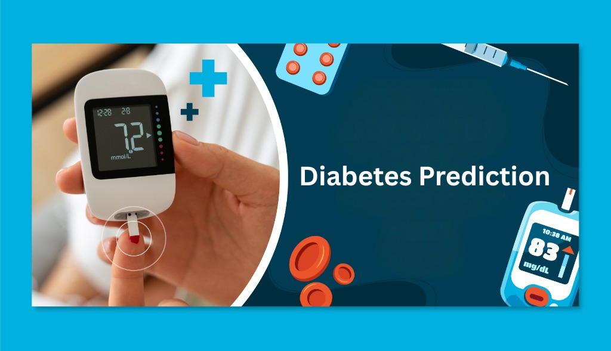

# Diabetes Prediction App

This is a Streamlit application for predicting diabetes based on medical measurements.

## Features
- Data exploration and visualization
- Interactive diabetes prediction
- Model performance metrics

### 🎯 Core Functionality
- **Interactive Prediction**: Input patient data to get instant diabetes risk assessment
- **Probability Visualization**: Clear visual representation of prediction confidence
- **Risk Interpretation**: Guidance on interpreting prediction results

### 📊 Data Exploration
- Dataset overview and statistics
- Interactive visualizations (histograms, correlation heatmaps)
- Class distribution analysis

### 📈 Model Performance
- Detailed classification metrics
- Confusion matrix visualization
- ROC curve with AUC score
- Cross-validation results

## Installation
1. Clone this repository
2. Install requirements: `pip install -r requirements.txt`
3. Run the app: `streamlit run app.py`

## Deployment
This app is deployed on Streamlit Cloud at [your-deployment-url]